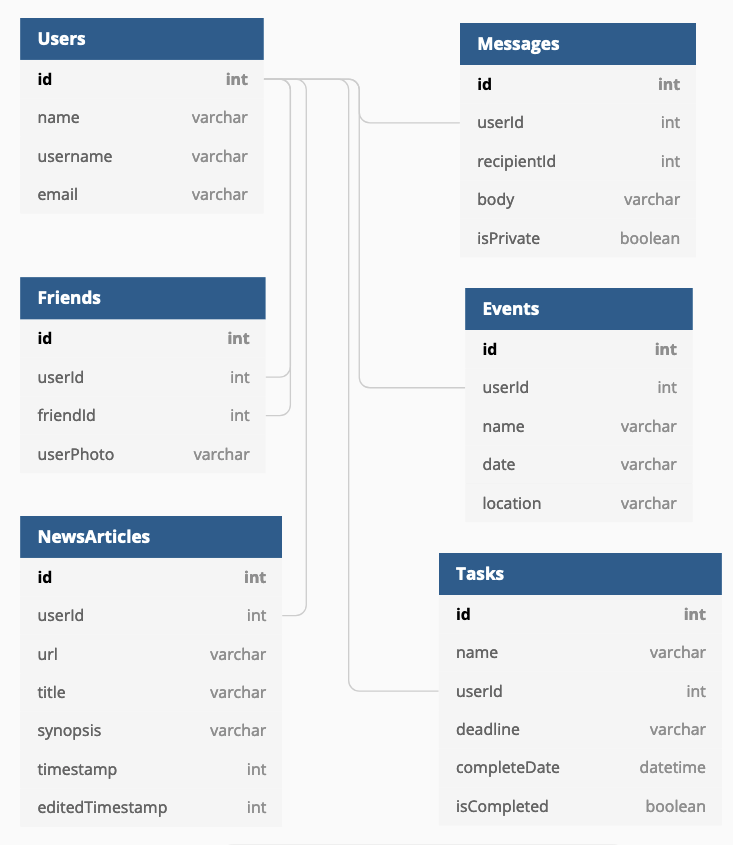

# Social Buzz

## Setup: Follow these steps exactly

1. Use terminal to clone this repository
1. `cd` into the directory it creates
```
git clone git@github.com:NSS-Day-Cohort-49/react-nutshell-state-slingers.git
cd react-nutshell-state-slingers
```
1. Create an `api` directory outside of the project directory.
1. In the `api` directory, create a copy of the `database.json.example` and remove the `.example` extension.
1. Run `json-server -p 8088 -w database.json` from the `api` directory.
1. Run `npm install` and wait for all dependencies to be installed.
1. Run `npm start` to verify that installation was successful.

> **Note:** Your `database.json` file is already in the `.gitignore` file for this project, so it will never be added to the repo or pushed to Github.

## What is Social Buzz?

Social Buzz is a web app built with the ReatJS library for organizing daily tasks, events, news article, friends, and chat messages.

Following are examples of how the resources in your API should look once it is populated with data from the application.

### Users

```json
{
      "id": 1,
      "name": "Luz Madrazo",
      "username": "luzm321",
      "email": "luz@madrazo.com",
      "userPhoto": "./images/luzPhoto.png"
    }
```

### Friends

```json
{
      "userId": 3,
      "buddyId": 4,
      "id": 1
    }
```

### Messages

```json
{
      "id": 1,
      "userId": 2,
      "body": "Learning React has been interesting! 💥",
      "isPrivate": false,
      "recipientId": null
    }
```
### News Articles

```json
{
    "id": 1,
    "userId": 2,
    "url": "https://www.quantamagazine.org/newfound-wormhole-allows-information-to-escape-black-holes-20171023/",
    "title": "Wormholes Allow Information to Escape Black Holes",
    "synopsis": "Check out this recent discovery about workholes",
    "timestamp": "2/11/2021"
}
```

### Events

```json
{
      "id": 2,
      "userId": 1,
      "name": "Language Learner Meetup",
      "date": 1529311980321,
      "location": "Lingo Central"
    }
```

### Tasks

```json
{
      "id": 1,
      "name": "style tasks",
      "userId": 3,
      "deadline": "2021-07-21",
      "isCompleted": false,
      "completeDate": 0
    }
```

